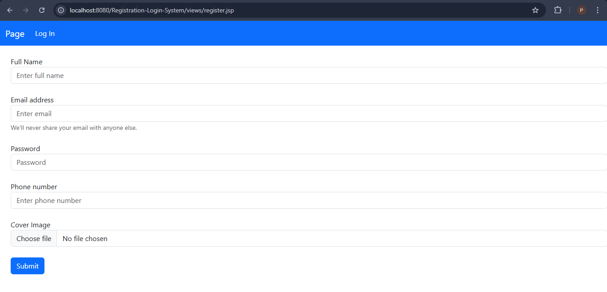
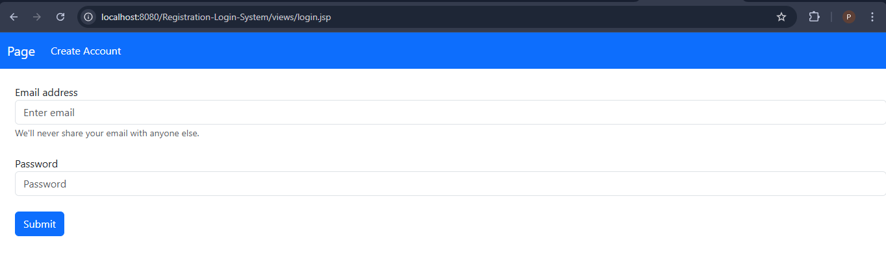
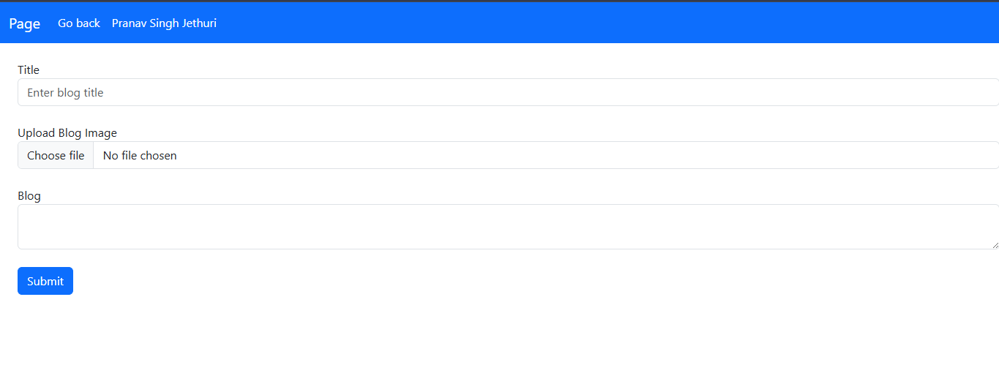

<h1>Registration-Login-System</h1>
Here are some screenshots of my work..
<h4>Registration Page</h4>

<h4>Login Page</h4>

<h2>I am planning to extend the project by making it into a blogging website but its not completed yet.</h2>
<h4>Blog create Page</h4>

<h4>Blog view Page</h4>

